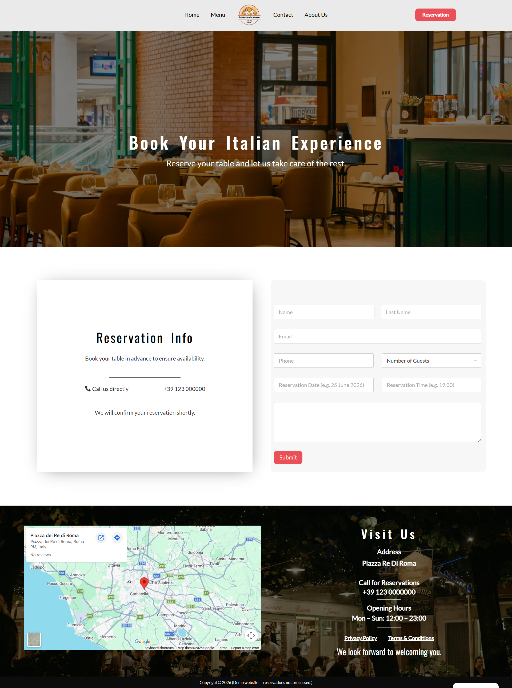

# 🍝 Trattoria da Marco – Restaurant Website

🚀 A fully responsive restaurant website built with WordPress, focused on user experience, SEO optimization, and conversion-driven design.

🔗 Live Demo: https://ristorante.mardass.com/

---

## ✨ Key Features

- 📱 Fully responsive design (Mobile, Tablet, Desktop)
- 🍽️ Modern restaurant UI/UX with visual storytelling
- 📋 Dynamic menu page with categorized dishes
- 📅 Reservation system with custom form (WPForms)
- 📍 Google Maps integration for location
- 📧 Email marketing integration (Mailchimp popup)
- 🔒 GDPR-ready Privacy Policy & Terms pages
- ⚡ Optimized performance and loading speed

---

## 🧠 SEO Optimization

SEO was implemented using Rank Math plugin with focus on key landing pages:

- Home Page
- Menu Page
- About Page

### 🔑 Strategy

- Focus keyword research using Mangools & AI assistance
- Manual optimization of:
  - Meta titles & descriptions
  - Heading structure (H1, H2, H3)
  - Content readability
- Google Search Console indexing

---

## Optimized using:
- Image compression
- Clean layout structure
- Reduced blocking scripts

---

###  Performances
- [Mobile Performance](./screenshots/12-pagespeed-mobile.png)
- [Desktop Performance](./screenshots/11-pagespeed-desktop.png)

---

## 📬 Email Marketing Integration

- Popup discount offer (10% OFF)
- Integrated via Mailchimp script
- Embedded in website header using WPCode

### Funnel:
Visitor → Popup → Email capture → Discount email

---

## 📸 Screenshots

### 🏠 Homepage

---

### 🛍️ Menu Page

---

### 📦 Reservation Page

---

## 📱 Mobile View

👉 [Homepage (Mobile)](screenshots/13-mobile-home.png.png)  
👉 [Menu Page (Mobile)](screenshots/14-mobile-menu.png.png)  
👉 [Reservation Page (Mobile)](screenshots/17-mobile-reservation.png.png)

---

## 🛠️ Tech Stack

- WordPress
- Elementor
- WPForms
- Rank Math SEO
- WPCode (custom scripts)
- Mailchimp
- WordFence

---

## 🎯 Highlights

- Real-world restaurant scenario
- Conversion-focused design (CTA, popup, reservation)
- SEO + Performance combined
- Clean UI with strong visual hierarchy

---

## 📌 Notes

This project focuses on combining:
- Design (UI/UX)
- SEO fundamentals
- Marketing integration

to simulate a real business website.

---

### 📄 Other Pages

- [About Page](screenshots/03-about.png)
- [Contact Page](screenshots/04-contact.png)
- [Privacy Policy](screenshots/07-privacy-policy.png)
- [Terms & Conditions](screenshots/06-terms-conditions.png)

---

## 👨‍💻 Author

Developed by [Peyman Ayoubvand]
